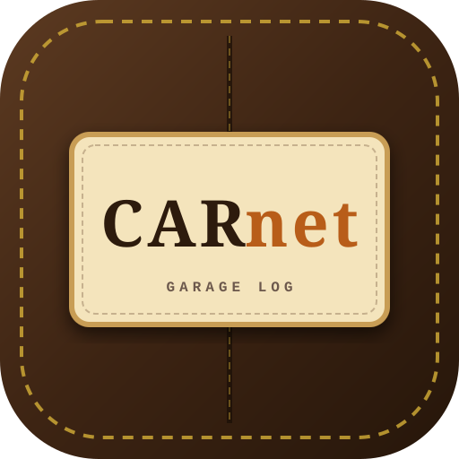

<p align="center"></p>

<h1 align="center">CARnet - Garage Log</h1>
<p align="center">Carnet d'entretien automobile intelligent pour Home Assistant</p>

<p align="center">


</p>

**Carnet d'entretien automobile intelligent pour Home Assistant**, généré et
tenu à jour par **Google Gemini** : plan d'entretien basé sur un catalogue
fixe de ~28 opérations, points de vigilance connus, rappels constructeur,
estimation de valeur de revente, et une carte Lovelace dédiée avec quatre
thèmes visuels au choix.

Stockage 100 % local, carte Lovelace servie par le composant (rien à copier
dans `www/` — une ressource à ajouter une fois via l'UI, voir installation),
IA optionnelle avec repli manuel si aucune clé n'est configurée.

<!-- 📸 Capture d'écran de la carte à ajouter ici -->

## ✨ Fonctionnalités

- 🔍 **Ajout d'un véhicule en 30 secondes** : marque, modèle et motorisation
  avec autocomplétion intelligente (référentiel local + suggestions Gemini
  mises en cache), année, kilométrage, plaque, photo.
- 🛠️ **Plan d'entretien basé sur un catalogue fixe** (~28 opérations codées
  en dur : vidange, tous les filtres, courroie de distribution **et**
  d'accessoires séparément, disques **et** plaquettes avant/arrière comme
  entrées distinctes, batterie, climatisation, FAP/EGR, contrôle
  technique, révision constructeur...). L'IA ne décide que de
  l'applicabilité et des intervalles pour chaque entrée — rien ne peut
  plus être oublié d'une génération à l'autre. Chaque échéance : intervalle
  km/mois, coût estimé, date prévisionnelle réelle, difficulté DIY et coût
  pièces si fait soi-même, avec explication détaillée générée à la demande.
- ✏️ **Corrections manuelles à tout moment** : case applicable/non
  applicable par échéance, ajustement direct de la date ou du kilométrage
  d'échéance, ajout d'un entretien manquant sans régénérer tout le plan.
- ⚠️ **Points de vigilance & pannes connues** spécifiques au modèle, avec
  gravité, coût indicatif et sources citées.
- 🚨 **Rappels constructeur actifs** recherchés par IA à la création,
  mutualisés par modèle et rafraîchissables, avec sources et avertissement
  à vérifier sur les canaux officiels.
- 💶 **Suivi de la valeur de revente** dans le temps, avec fourchette et
  raisonnement détaillé (tendance marché, décote, kilométrage).
- 📆 **Historique d'entretien horodaté** : chaque échéance se déplie pour
  enregistrer une intervention (bouton "fait aujourd'hui" ou date/km
  antérieurs), qui recalcule aussitôt les prochaines échéances.
- 🔗 **Kilométrage manuel ou lié à un capteur** existant de Home Assistant
  (odomètre constructeur, traceur OBD, `input_number`...).
- 🎨 **4 thèmes visuels** : Grand tourisme cuir, Manufacture horlogère,
  Carbone et titane, Atelier vintage — choix persistant via un panneau de
  réglages dédié.
- 🚙 **Multi-véhicules** avec sélecteur rapide et vue d'ensemble en tuiles.
- 🔧 **Services HA** pour tout piloter en automatisation (`add_vehicle`,
  `update_mileage`, `log_maintenance`, `value_snapshot`, `set_mileage_source`...).

## 🚀 Installation rapide

```text
HACS → ⋮ → Dépôts personnalisés → coller l'URL de ce dépôt → Intégration
→ Installer → redémarrer Home Assistant
→ Paramètres → Appareils et services → Ajouter une intégration → « Carnet d'entretien »
```

Guide complet, pas à pas, avec dépannage : **[docs/INSTALL.md](docs/INSTALL.md)**.

## 🔑 Clé Gemini

Optionnelle mais recommandée pour la génération automatique (plan, points de
vigilance, valeur, autocomplétion motorisation). Clé gratuite sur
[aistudio.google.com](https://aistudio.google.com). Sans clé, l'intégration
reste utilisable en saisie 100 % manuelle.

## 📄 Documentation

- [Guide d'installation et d'utilisation détaillé](docs/INSTALL.md)
- [Changelog](CHANGELOG.md)

## 🤝 Contribuer

Les retours, issues et pull requests sont les bienvenus.

## 📜 Licence

MIT — voir [LICENSE](LICENSE).
