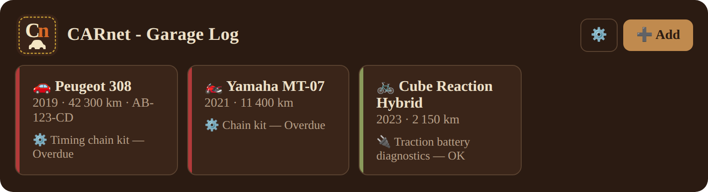
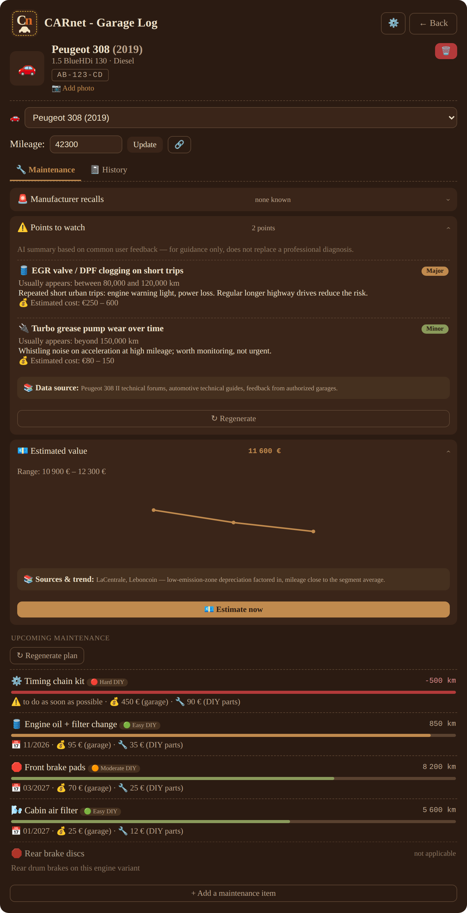
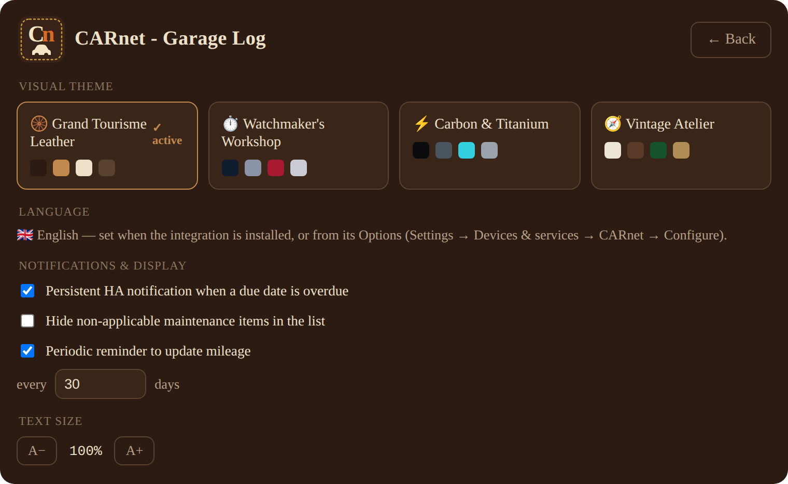
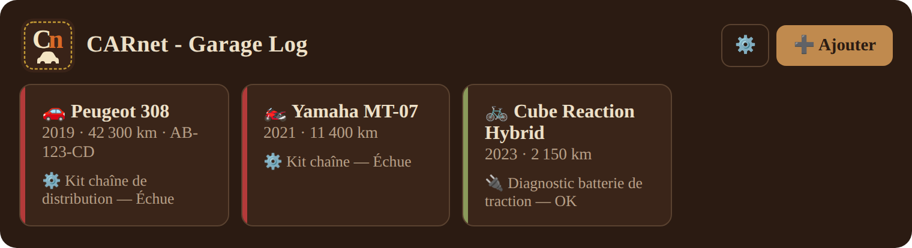
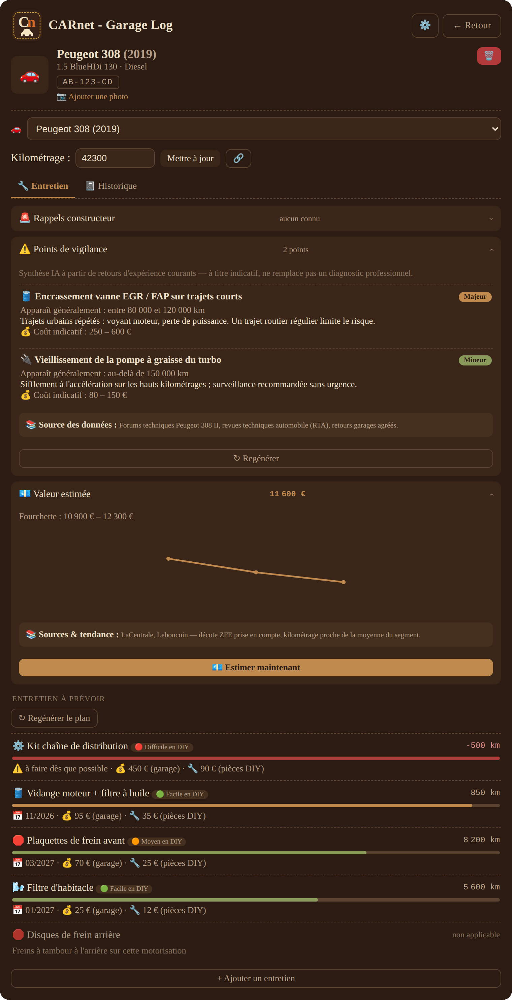
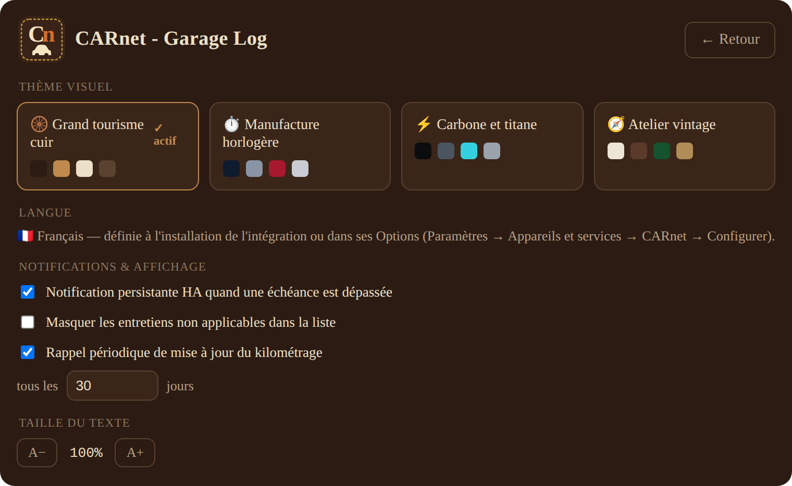

<p align="center"></p>

<h1 align="center">CARnet - Garage Log</h1>
<p align="center">Le carnet d'entretien qui pense à votre place / Your personal mechanic, right inside Home Assistant</p>

<p align="center">


</p>

<p align="center"><a href="#english">English</a> · <a href="#français">Français</a></p>

<p align="center">
  <a href="https://ko-fi.com/aldoushx">
    
  </a>
</p>
<p align="center">
  🐱 <b>Lina</b> mérite mieux que de la nourriture bas de gamme — si ce projet vous rend service, <a href="https://ko-fi.com/aldoushx">offrez-lui quelques croquettes</a>.<br/>
  🐱 <b>Lina</b> deserves better than bottom-shelf kibble — if this project is useful to you, <a href="https://ko-fi.com/aldoushx">toss her a few treats</a>.
</p>

---

<a id="english"></a>
## 🇬🇧 English

**CARnet - Garage Log** turns Home Assistant into a personal mechanic for
your **cars, motorcycles, scooters and e-bikes**. Tell it what you drive,
and it builds a maintenance plan researched for your exact model, flags
what's coming due, prices out the job both at a garage and DIY, and keeps
an eye on your vehicle's resale value — all from one dashboard card.

<p align="center"></p>

Everything stays local — no cloud account, no telemetry, no subscription.
Google Gemini powers the research (a generous free tier is enough for
personal use); without it, CARnet still works as a fully manual logbook.

### 🌟 What makes it different

A spreadsheet tells you what you've already done. CARnet tells you
**what's coming, when, what it'll cost, and how to do it yourself** — for
your exact vehicle, not a generic one.

- 🔍 **A plan built on real research.** For your exact
  brand/model/engine/year, Gemini checks the manufacturer's service
  schedule and technical sources to work out what actually applies and
  when — not a blanket "every 10,000 km" rule.
- 🛠️ **DIY cost and step-by-step guidance, on demand.** Every item shows
  the parts-only price next to the garage quote, and one click generates
  a model-specific how-to: tools, steps, difficulty.
- 💶 **Garage price vs. DIY price**, side by side, so you can decide in
  advance whether it's worth doing yourself.
- 🔔 **Notifications, not a page you have to remember to check.** A
  persistent alert fires the moment something is overdue or a mileage
  reminder comes due — and can trigger your own automations too.
- 🔗 **Real mileage, not a guess.** Link an existing sensor (OBD dongle,
  odometer integration, `input_number`) and every due date recalculates
  itself as the reading updates.
- 📈 **A resale value grounded in the current market** — trend,
  mileage vs. the segment average, condition — with a written rationale,
  trackable over time.
- ⚠️ **The issues other owners run into most**, for your exact model,
  with severity and an indicative repair cost, plus active manufacturer
  recalls checked on creation.

<p align="center"></p>

### ✨ Everything else it does

- 🚗🏍️🛵🚲 **Cars, motorcycles, scooters and e-bikes** — each with its own
  dedicated maintenance catalog, so a car never sees a motorcycle item.
- 🛠️ **A fixed operations catalog per vehicle type** (46 for a car, 26 for
  a motorcycle/scooter, 15 for an e-bike) — oil, filters, belts, discs and
  pads, battery, A/C, roadworthiness inspection and more, each with an
  interval, a forecast date, a garage cost and a DIY cost.
- ✏️ **Manual corrections whenever you want**: mark an item not
  applicable, override a due date or mileage, or add an operation the
  catalog missed.
- 📆 **A timestamped history** — log a service in one click, or backdate
  an earlier one; due dates recalculate instantly.
- 🎨 **Four visual themes** to make the card your own.

<p align="center"></p>

- 🌍 **Five languages** — English, French, German, Spanish, Italian —
  covering the card, the catalog, everything Gemini generates and every
  notification.
- 🚙 **Multiple vehicles**, with a quick switcher and a tile overview.
- 🔧 **Home Assistant services** to drive it all from automations.

### 1. Requirements

- Home Assistant 2024.1 or newer.
- (Optional but recommended) A free Gemini API key — without one, CARnet
  still works, just without automatic plan generation, known issues or
  the value estimate.
  1. Go to [aistudio.google.com](https://aistudio.google.com) and sign in
     with a Google account.
  2. Click **Get API key** → **Create API key**.
  3. Pick or create a Google Cloud project — no billing details needed
     for the free tier.
  4. Copy the key (starts with `AIza...`); you'll paste it in during
     setup. If you ever hit the daily quota, CARnet automatically
     retries with other Gemini models.
- HACS, if you want the "custom repository" route (a manual install works
  just as well).

### 2. Installation

**Option A — HACS**

1. HACS → ⋮ → **Custom repositories** → paste this repository's URL,
   category **Integration**.
2. Search for "CARnet - Garage Log", install, then **restart Home
   Assistant**.

**Option B — Manual**

1. Copy `custom_components/carnet_entretien/` into
   `config/custom_components/` on your Home Assistant instance.
2. **Restart Home Assistant**.

### 3. Configure the integration

1. **Settings → Devices & services → Add integration** → search for
   **CARnet - Garage Log**.
2. Fill in your Gemini API key (optional), and **pick a content
   language** — this one setting drives the card, the catalog, everything
   Gemini writes, and every notification.
3. Confirm — vehicles and devices appear as you add them from the card.

Both the key and the language can be changed later from **Settings →
Devices & services → CARnet - Garage Log → Configure**. Changing the
language doesn't retranslate content Gemini already generated for
existing vehicles — that stays as-is until you regenerate it, so a
language switch never spends AI quota on its own.

### 4. Add the card to a dashboard

The card is served by the integration — nothing to copy into `www/` —
but it needs registering as a dashboard resource once:

1. **Settings → Dashboards → ⋮ → Resources → Add resource**:
   - URL: `/carnet_entretien/carnet-entretien-card.js`
   - Type: **JavaScript module**
2. Save, then hard-reload your browser (Ctrl+Shift+R / Cmd+Shift+R).
3. **Edit dashboard → Add card** → search **"CARnet - Garage Log"**, or
   add manually:
   ```yaml
   type: custom:carnet-entretien-card
   ```

An update to the integration changes the file's content but not its URL,
so a browser cache reload is all you'll need afterwards.

#### The card doesn't appear / "Custom element doesn't exist"

Almost always the resource above is missing, mistyped, or cached. Work
through this in order:

1. Check it's really registered (Settings → Dashboards → ⋮ → Resources)
   with type **JavaScript module**, and the URL is exactly
   `/carnet_entretien/carnet-entretien-card.js` — no `www/`, no version
   suffix.
2. Hard-reload every browser/device you use for the dashboard, including
   the mobile Companion App (fully close and reopen it).
3. Open
   `http://YOUR-HA-ADDRESS:8123/carnet_entretien/carnet-entretien-card.js`
   directly — you should see raw JavaScript. A 404 means the file isn't
   being served; check the Home Assistant logs for a `carnet_entretien`
   line at startup, and confirm every file was copied if you installed
   manually.
4. Remove any duplicate resource entries — keep exactly one pointing at
   the URL above.
5. Still stuck? Remove the resource, hard-reload, restart Home Assistant,
   then add the resource again from scratch.

### 5. First use

1. Click **➕ Add** on the card.
2. Pick **🚗 Car** or **🏍️ Two-wheeler** — this decides the catalog and
   the brand/model suggestions.
3. Type a **brand** and **model** (free text always works, even if
   they're not in the list), then fill in year, mileage, plate, fuel
   type and a photo — all optional except brand/model/year.
4. Confirm — three quick generation steps run (manufacturer info →
   maintenance plan → known issues), 15 to 45 seconds depending on load.
5. You land on the vehicle page with four tabs: **Maintenance** (items
   sorted by urgency), **Known issues**, **Value** and **History**.

### 6. Automate with services

All services are under **Developer tools → Actions**, prefixed
`carnet_entretien.` — `add_vehicle`, `update_mileage`, `log_maintenance`,
`value_snapshot`, `set_mileage_source`... Two examples:

**Weekly value estimate** (`automations.yaml`):
```yaml
alias: Vehicle value estimate - weekly
trigger:
  - platform: time
    at: "08:00:00"
condition:
  - condition: time
    weekday: [mon]
action:
  - service: carnet_entretien.value_snapshot
    data:
      vehicle_id: "YOUR_VEHICLE_ID"
```

**Notify when an item becomes due**, using the
`sensor.<brand>_<model>_next_due_item` sensor's `statut` attribute:
```yaml
alias: Vehicle maintenance alert
trigger:
  - platform: state
    entity_id: sensor.peugeot_308_prochaine_echeance
    attribute: statut
    to: "echue"
action:
  - service: notify.mobile_app_your_phone
    data:
      message: >
        Overdue item on the 308: {{ state_attr('sensor.peugeot_308_prochaine_echeance','km_restants') }} km overdue.
```

A vehicle's `id` is visible in its sensors' attributes, or under the
matching device in Settings → Devices.

### 7. Customize the brand/model suggestions

`custom_components/carnet_entretien/data/referentiel.json` holds the
autocomplete suggestions, split by category so a motorcycle brand never
shows up while adding a car:

```json
{
  "auto": { "Peugeot": ["208", "308", "New model"] },
  "moto": { "Yamaha": ["MT-07"] },
  "scooter": { "Piaggio": ["Liberty 125"] },
  "velo_electrique": { "Cube": ["Reaction Hybrid"] }
}
```

Restart Home Assistant after editing. Free-text entry always works even
for a model missing from the file.

### 8. Troubleshooting

| Symptom | Likely cause | Fix |
|---|---|---|
| Card doesn't appear | Lovelace resource missing, mistyped or cached | See [§4](#the-card-doesnt-appear--custom-element-doesnt-exist) |
| "no_model" when adding a vehicle | No Gemini key set, or an invalid one | Check the key in the integration's Options |
| "rate_limited" / "Quota exceeded" | Daily Gemini quota reached | Wait or retry — CARnet falls back to other models automatically |
| "timeout" | Gemini API slow or overloaded | Retry with "↻ Regenerate" |
| Text stays in the wrong language after switching | Interface and catalog translate instantly; AI-generated content keeps its original language until regenerated | Regenerate the plan / known issues / recalls, or ask for a new DIY explanation |

### 9. Good to know

- The brand/model list is curated, not exhaustive — extend it per
  [§7](#7-customize-the-brandmodel-suggestions).
- The annual mileage estimate used to rank due items gets more accurate
  as you log more mileage history.
- AI content is a synthesis of public information, not certified
  manufacturer data — always double-check anything safety-related.

### 🤝 Contributing

Feedback, issues and pull requests are welcome.

### 📜 License

MIT — see [LICENSE](LICENSE).

---

<a id="français"></a>
## 🇫🇷 Français

**CARnet - Garage Log** transforme Home Assistant en mécanicien
personnel pour vos **voitures, motos, scooters et vélos électriques**.
Indiquez ce que vous conduisez, et l'intégration construit un plan
d'entretien recherché pour votre modèle exact, signale ce qui approche,
chiffre chaque intervention en garage comme en DIY, et surveille la
valeur de revente du véhicule — le tout depuis une seule carte.

<p align="center"></p>

Tout reste local — aucun compte cloud, aucune télémétrie, aucun
abonnement. Google Gemini alimente la recherche (le forfait gratuit
suffit largement pour un usage personnel) ; sans lui, CARnet reste
pleinement utilisable en carnet manuel.

### 🌟 Ce qui fait la différence

Un tableur vous dit ce que vous avez déjà fait. CARnet vous dit **ce qui
arrive, quand, combien ça coûte, et comment le faire vous-même** — pour
votre véhicule précis, pas un modèle générique.

- 🔍 **Un plan construit sur une vraie recherche.** Pour votre
  marque/modèle/motorisation/année exacte, Gemini vérifie le programme
  d'entretien constructeur et des sources techniques pour déterminer ce
  qui s'applique réellement et à quel rythme — pas une règle générique
  "tous les 10 000 km".
- 🛠️ **Coût DIY et conseils pas à pas, à la demande.** Chaque échéance
  affiche le prix des pièces seules à côté du tarif garage, et un clic
  génère un mode d'emploi spécifique au modèle : outils, étapes,
  difficulté.
- 💶 **Prix garage vs. prix DIY**, côte à côte, pour décider à l'avance
  si ça vaut le coup de le faire soi-même.
- 🔔 **Des notifications, pas une page à penser à consulter.** Une
  alerte persistante se déclenche dès qu'une échéance est dépassée ou
  qu'un rappel au kilométrage tombe — et peut aussi déclencher vos
  propres automatisations.
- 🔗 **Un kilométrage réel, pas une estimation.** Liez un capteur
  existant (boîtier OBD, odomètre, `input_number`) et chaque échéance se
  recalcule automatiquement à chaque relevé.
- 📈 **Une valeur de revente ancrée dans le marché actuel** — tendance,
  kilométrage par rapport au segment, état du véhicule — avec un
  raisonnement écrit, à suivre dans le temps.
- ⚠️ **Les pannes les plus fréquemment rencontrées** par les autres
  propriétaires sur ce modèle précis, avec gravité et coût indicatif, et
  les rappels constructeur actifs vérifiés à la création.

<p align="center"></p>

### ✨ Et tout le reste

- 🚗🏍️🛵🚲 **Voitures, motos, scooters et vélos électriques** — chacun
  avec son propre catalogue d'entretien dédié : une voiture ne voit
  jamais un entretien de moto.
- 🛠️ **Un catalogue fixe d'opérations par type de véhicule** (46 pour une
  voiture, 26 pour une moto/scooter, 15 pour un vélo électrique) :
  vidange, filtres, courroies, disques et plaquettes, batterie,
  climatisation, contrôle technique et plus, chacune avec un intervalle,
  une date prévisionnelle, un coût garage et un coût DIY.
- ✏️ **Des corrections manuelles à tout moment** : marquer une échéance
  non applicable, ajuster une date ou un kilométrage, ou ajouter une
  opération oubliée par le catalogue.
- 📆 **Un historique horodaté** — enregistrez une intervention en un
  clic, ou antidatez-en une ; les échéances se recalculent aussitôt.
- 🎨 **Quatre thèmes visuels** pour personnaliser la carte.

<p align="center"></p>

- 🌍 **Cinq langues** — français, anglais, allemand, espagnol, italien —
  qui couvrent la carte, le catalogue, tout ce que Gemini génère et
  chaque notification.
- 🚙 **Multi-véhicules**, avec sélecteur rapide et vue d'ensemble en
  tuiles.
- 🔧 **Des services Home Assistant** pour tout piloter en automatisation.

### 1. Pré-requis

- Home Assistant 2024.1 ou plus récent.
- (Optionnel mais recommandé) Une clé API Gemini gratuite — sans elle,
  CARnet reste utilisable, simplement sans génération automatique du
  plan, des points de vigilance ni de l'estimation de valeur.
  1. Allez sur [aistudio.google.com](https://aistudio.google.com) et
     connectez-vous avec un compte Google.
  2. Cliquez sur **Get API key** → **Create API key**.
  3. Choisissez ou créez un projet Google Cloud — aucune information de
     facturation requise pour le forfait gratuit.
  4. Copiez la clé (elle commence par `AIza...`) ; vous la coller à
     l'installation. Si vous atteignez le quota quotidien, CARnet
     bascule automatiquement sur d'autres modèles Gemini.
- HACS, si vous voulez la voie "dépôt personnalisé" (l'installation
  manuelle fonctionne tout aussi bien).

### 2. Installation

**Option A — HACS**

1. HACS → ⋮ → **Dépôts personnalisés** → collez l'URL de ce dépôt,
   catégorie **Intégration**.
2. Recherchez "CARnet - Garage Log", installez, puis **redémarrez Home
   Assistant**.

**Option B — Manuelle**

1. Copiez `custom_components/carnet_entretien/` dans
   `config/custom_components/` de votre installation Home Assistant.
2. **Redémarrez Home Assistant**.

### 3. Configurer l'intégration

1. **Paramètres → Appareils et services → Ajouter une intégration** →
   cherchez **CARnet - Garage Log**.
2. Renseignez votre clé Gemini (optionnelle), et **choisissez une langue
   de contenu** — ce seul réglage pilote la carte, le catalogue, tout ce
   que Gemini rédige, et chaque notification.
3. Validez — véhicules et appareils apparaissent au fur et à mesure que
   vous les ajoutez depuis la carte.

La clé comme la langue peuvent être modifiées ensuite depuis
**Paramètres → Appareils et services → CARnet - Garage Log →
Configurer**. Changer de langue ne retraduit pas le contenu déjà généré
par Gemini pour un véhicule existant — il reste tel quel jusqu'à sa
prochaine régénération, pour qu'un changement de langue ne consomme
jamais de quota IA de lui-même.

### 4. Ajouter la carte au tableau de bord

La carte est servie par l'intégration — rien à copier dans `www/` — mais
elle doit être enregistrée une fois comme ressource de tableau de bord :

1. **Paramètres → Tableaux de bord → ⋮ → Ressources → Ajouter une
   ressource** :
   - URL : `/carnet_entretien/carnet-entretien-card.js`
   - Type : **Module JavaScript**
2. Enregistrez, puis rechargez complètement le cache du navigateur
   (Ctrl+Maj+R / Cmd+Maj+R).
3. **Modifier le tableau de bord → Ajouter une carte** → cherchez
   **"CARnet - Garage Log"**, ou ajoutez manuellement :
   ```yaml
   type: custom:carnet-entretien-card
   ```

Une mise à jour de l'intégration change le contenu du fichier mais pas
son URL : un simple rechargement du cache suffira ensuite.

#### La carte n'apparaît pas / "Custom element doesn't exist"

C'est presque toujours la ressource ci-dessus manquante, mal
orthographiée ou mise en cache. Dans l'ordre :

1. Vérifiez qu'elle est bien enregistrée (Paramètres → Tableaux de bord
   → ⋮ → Ressources) avec le type **Module JavaScript**, et que l'URL
   est exactement `/carnet_entretien/carnet-entretien-card.js` — pas de
   `www/`, pas de suffixe de version.
2. Rechargez le cache sur chaque appareil/navigateur utilisé, y compris
   l'app mobile Companion (fermez-la et rouvrez-la complètement).
3. Ouvrez directement
   `http://ADRESSE-DE-VOTRE-HA:8123/carnet_entretien/carnet-entretien-card.js`
   — vous devez voir du JavaScript brut. Une erreur 404 signifie que le
   fichier n'est pas servi : consultez les journaux Home Assistant à la
   recherche d'une ligne `carnet_entretien` au démarrage, et vérifiez que
   tous les fichiers sont bien présents si vous avez fait une
   installation manuelle.
4. Supprimez toute ressource en double — ne gardez qu'une seule entrée
   pointant vers l'URL ci-dessus.
5. Toujours bloqué ? Supprimez la ressource, rechargez le cache,
   redémarrez Home Assistant, puis rajoutez la ressource depuis zéro.

### 5. Premier usage

1. Cliquez **➕ Ajouter** sur la carte.
2. Choisissez **🚗 Auto** ou **🏍️ 2 roues** — ce choix détermine le
   catalogue et les suggestions marque/modèle.
3. Tapez une **marque** et un **modèle** (la saisie libre fonctionne
   toujours, même hors liste), puis renseignez année, kilométrage,
   plaque, type de carburant et une photo — tout facultatif sauf
   marque/modèle/année.
4. Validez — trois étapes de génération s'enchaînent (info constructeur
   → plan d'entretien → points de vigilance), 15 à 45 secondes selon la
   charge.
5. Vous arrivez sur la fiche véhicule avec quatre onglets :
   **Entretien** (échéances triées par urgence), **Points de
   vigilance**, **Valeur** et **Historique**.

### 6. Automatiser avec les services

Tous les services sont dans **Outils de développement → Actions**,
préfixés `carnet_entretien.` — `add_vehicle`, `update_mileage`,
`log_maintenance`, `value_snapshot`, `set_mileage_source`... Deux
exemples :

**Estimation de valeur hebdomadaire** (`automations.yaml`) :
```yaml
alias: Estimation valeur véhicules - hebdo
trigger:
  - platform: time
    at: "08:00:00"
condition:
  - condition: time
    weekday: [mon]
action:
  - service: carnet_entretien.value_snapshot
    data:
      vehicle_id: "VOTRE_ID_VEHICULE"
```

**Notification quand une échéance est due**, via l'attribut `statut` du
capteur `sensor.<marque>_<modele>_prochaine_echeance` :
```yaml
alias: Alerte entretien véhicule
trigger:
  - platform: state
    entity_id: sensor.peugeot_308_prochaine_echeance
    attribute: statut
    to: "echue"
action:
  - service: notify.mobile_app_votre_telephone
    data:
      message: >
        Échéance dépassée sur la 308 : {{ state_attr('sensor.peugeot_308_prochaine_echeance','km_restants') }} km de retard.
```

L'`id` d'un véhicule est visible dans les attributs de ses capteurs, ou
sous l'appareil correspondant dans Paramètres → Appareils.

### 7. Personnaliser les suggestions marque/modèle

`custom_components/carnet_entretien/data/referentiel.json` contient les
suggestions d'autocomplétion, séparées par catégorie pour qu'une marque
de moto n'apparaisse jamais lors de l'ajout d'une voiture :

```json
{
  "auto": { "Peugeot": ["208", "308", "Nouveau modèle"] },
  "moto": { "Yamaha": ["MT-07"] },
  "scooter": { "Piaggio": ["Liberty 125"] },
  "velo_electrique": { "Cube": ["Reaction Hybrid"] }
}
```

Redémarrez Home Assistant après modification. La saisie libre reste
toujours possible pour un modèle absent du fichier.

### 8. Dépannage

| Symptôme | Cause probable | Solution |
|---|---|---|
| La carte n'apparaît pas | Ressource Lovelace manquante, mal orthographiée ou mise en cache | Voir [§4](#la-carte-napparaît-pas--custom-element-doesnt-exist) |
| "no_model" à l'ajout d'un véhicule | Pas de clé Gemini, ou clé invalide | Vérifiez la clé dans les Options de l'intégration |
| "rate_limited" / "Quota dépassé" | Quota Gemini quotidien atteint | Patientez ou réessayez — CARnet bascule automatiquement sur d'autres modèles |
| "timeout" | API Gemini lente ou surchargée | Réessayez avec "↻ Regénérer" |
| Le texte reste dans la mauvaise langue après changement | L'interface et le catalogue se traduisent instantanément ; le contenu généré par l'IA garde sa langue d'origine jusqu'à régénération | Régénérez le plan / les points de vigilance / les rappels, ou relancez une demande DIY |

### 9. Bon à savoir

- Le référentiel marque/modèle est sélectif, pas exhaustif — étoffez-le
  selon [§7](#7-personnaliser-les-suggestions-marquemodèle).
- L'estimation de kilométrage annuel utilisée pour classer les échéances
  s'affine à mesure que vous enregistrez de l'historique.
- Le contenu IA est une synthèse d'informations publiques, pas une
  donnée constructeur certifiée — vérifiez toujours ce qui touche à la
  sécurité.

### 🤝 Contribuer

Les retours, issues et pull requests sont les bienvenus.

### 📜 Licence

MIT — voir [LICENSE](LICENSE).
